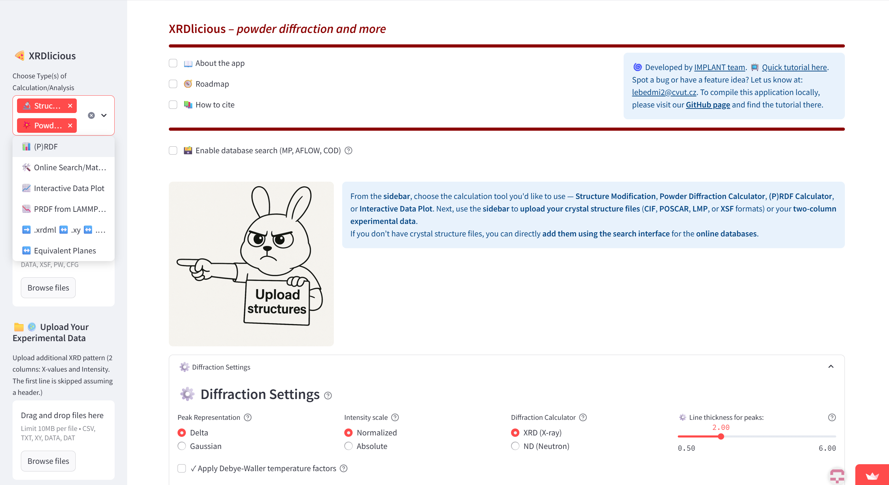
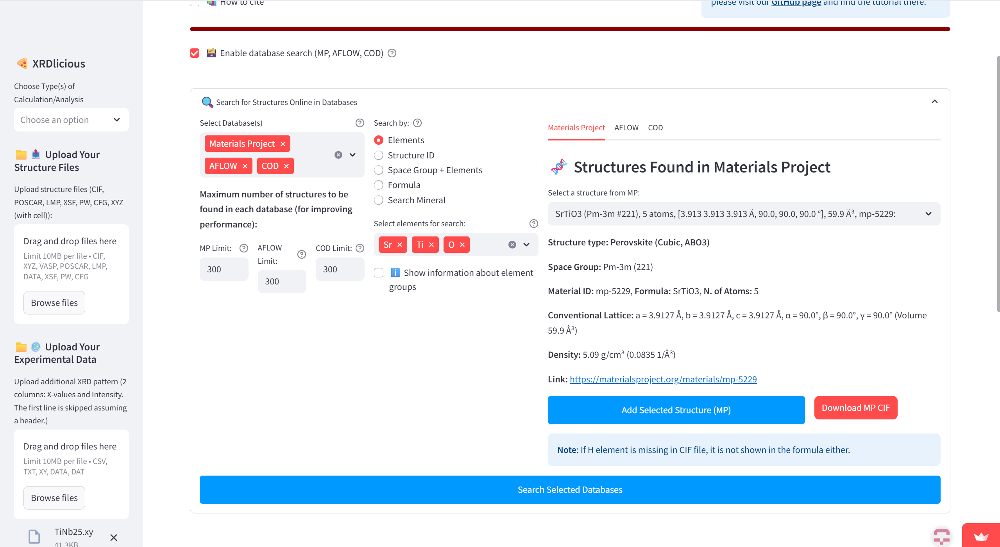
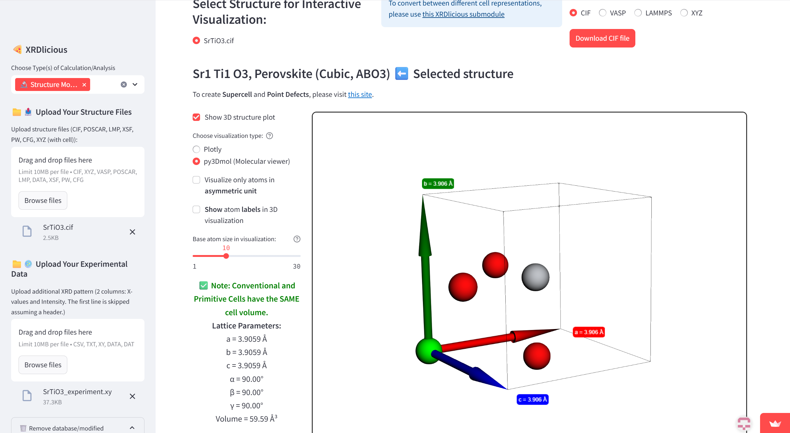
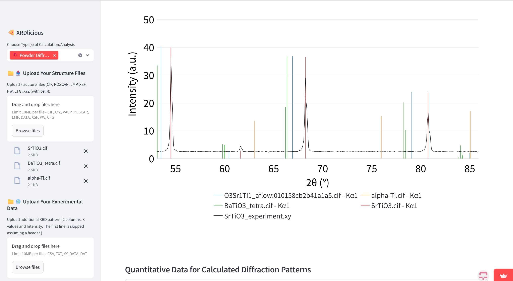
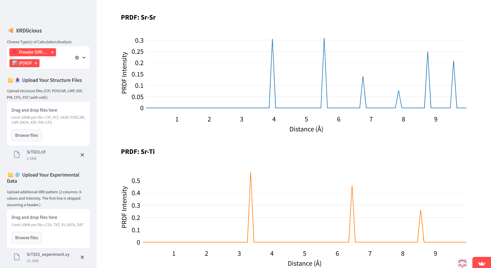
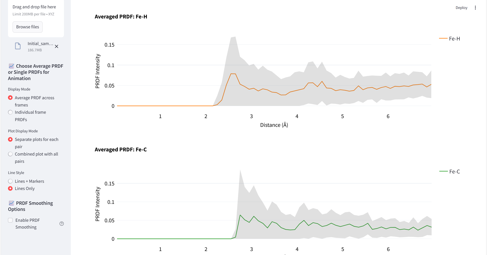
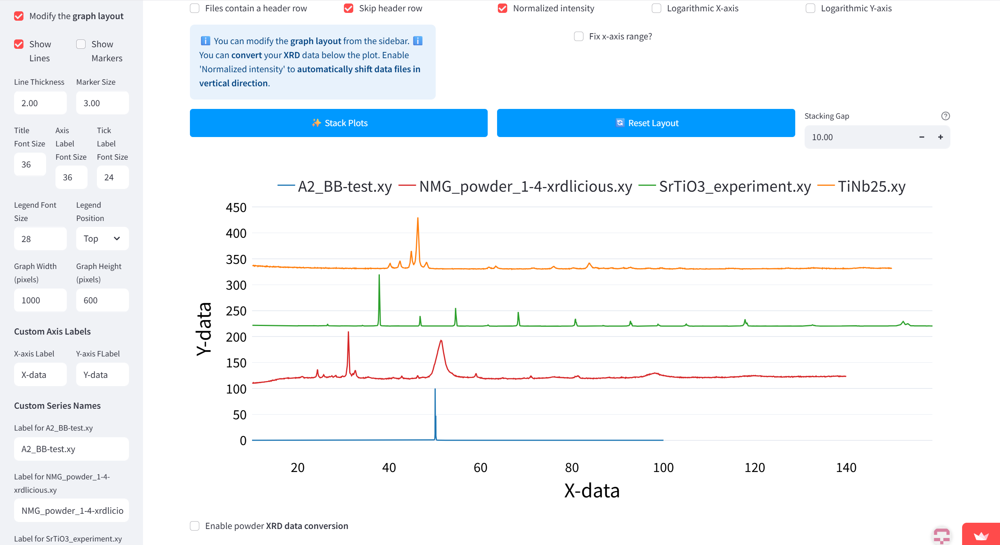
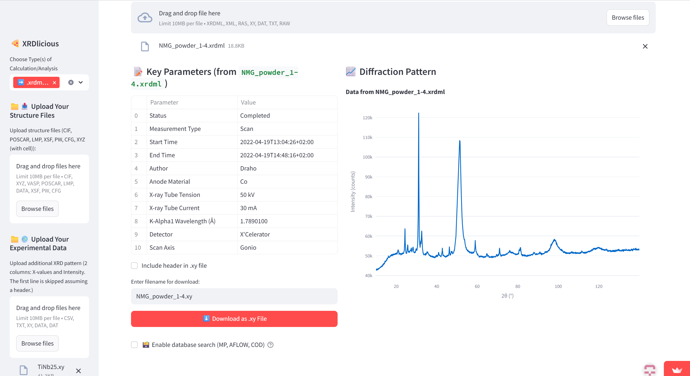

# **XRDlicious: Powder XRD/ND patterns and PRDF online calculator**

An online, web-based tool for calculating powder X-ray and neutron diffraction (XRD and ND) patterns, as well as partial and total radial distribution functions (PRDF, RDF) from crystal structures (CIF, VASP, LMP, XYZ (with cell information)).
It features an integrated search interface for directly accessing and importing structures from the Materials Project (MP), Automatic FLOW (AFLOW), and Crystallography Open Database (COD) databases. Users can also interactively visualize uploaded structures and perform basic modifications (change elements, occupancies, lattice parameters), convert between conventional and primitive cells and introduce point defects, and download the corresponding files in different formats (CIF, VASP, LMP, XYZ). 

# **Use the XRDlicious online**
🔗 Try the application online here: [XRDlicious](https://rdf-xrd-calculator.streamlit.app/)  
🔗 For creation of supercells and point defects, please use the submodule here: [Point defects](https://xrdlicious-point-defects.streamlit.app/) 
🔗 For (P)RDF calculations from LAMMPS or XYZ trajectories, please compile separated module locally here: [(P)RDF from LAMMPS/XYZ](https://github.com/bracerino/PRDF-CP2K-LAMMPS) 
🔗 For tutorials how to use the XRDlicious, please visit this site:[implant.fs.cvut.cz/xrdlicious](https://implant.fs.cvut.cz/xrdlicious/)

For more computationally demanding calculations with more extensive data, please compile the code locally on your computer (follow the manual below).
For planned features and modifications in the app, please see the Roadmap on the application website.

# **How to compile and run the XRDlicious locally:** 

### **Prerequisities**: 
- Python 3.x (Tested 3.12)
- Console (For Windows, I recommend to use WSL2 (Windows Subsystem for Linux))
- Git (optional for downloading the code)
  

### **Compile the app**  
Open your terminal console and write the following commands (the bold text):  
(Optional) Install Git:  
      **sudo apt update**  
      **sudo apt install git**    
      
1) Download the XRDlicious code from GitHub (or download it manually without Git on the following link by clicking on 'Code' and 'Download ZIP', then extract the ZIP. With Git, it is automatically extracted):  
      **git clone https://github.com/bracerino/xrdlicious.git**

2) Navigate to the downloaded project folder:  
      **cd xrdlicious/**

3) Create a Python virtual environment to prevent possible conflicts between packages:  
      **python3 -m venv xrdlicious_env**

4) Activate the Python virtual environment (before activating, make sure you are inside the xrdlicious folder):  
      **source xrdlicious_env/bin/activate**
   
5) Install all the necessary Python packages:  
      **pip install -r requirements.txt**

6) Run the XRDlicious app (always before running it, make sure to activate its Python virtual environment (Step 4):  
      **streamlit run app.py**

### **Tested versions of Python packages**
Python 3.12.3  

- numpy==1.26.4  
- matplotlib==3.10.3  
- ase==3.25.0  
- matminer==0.9.3  
- pymatgen==2025.5.28  
- plotly==6.1.2  
- streamlit-plotly-events==0.0.6  
- setuptools==80.9.0  
- mp-api==0.45.3  
- aflow==0.0.11  
- pillow==11.2.1  
- pymatgen-analysis-defects==2025.1.18
- psutil==7.0.0  

## Current functions:
### Structure retrieval from databases
- Search interface for MP, AFLOW, and COD databases. Structures can be directly added to the application, or their CIF can be downloaded and they can be accessed on the original link.

### Structure visualization and modification 
- Visualize data, modify atomic elements, occupancies, and lattice parameters, download structures in CIF, VASP, LMP, XYZ (with lattice) formats

### Powder XRD and ND patterns
- Calculate theoretical powder XRD, ND patterns from uploaded structures or structures retrieved from MP, AFLOW, and COD databases. Upload experimental diffraction data (.xy format) and subtract their backgroud for comparison with theoretical patterns.

### Partial (PRDF) and total (RDF) radial distribution functions
- Calculate (P)RDF from the uploaded structures

### (P)RDF from LAMMPS or XYZ trajectories
- Calculate (P)RDF from the trajectory file (.lammps or .xyz) at given frame sampling. Allows to plot average (P)RDF across the selected frames, or (P)RDF at individual frames with the animation showing its (P)RDF evolution over time. Requires [separated local compilation](https://github.com/bracerino/PRDF-CP2K-LAMMPS) due to the high computational demand.  

### Interactive data visualization and XRD data conversion
- Upload multiple two column data files and perform operations, such as automatic vertical stacking, or convert XRD data between different wavelengths or q-space and d-space representations.

### Powder diffraction file formats conversion
- Convert from .xrdml (PANalytical), .ras (Rigaku), .raw (Bruker) data formats into .xy format and vice versa. It is possible to upload multiple files and perform batch conversion.

